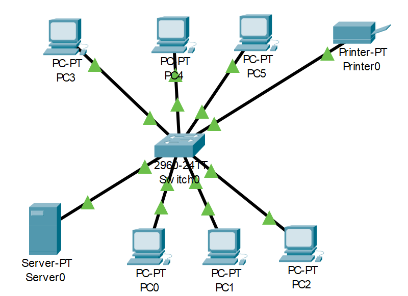

# 01 — Basic Local Area Network

This lab simulates a small LAN of 9 devices  6 PCs, a server, a printer, and a switch  all connected together and able to reach each other by IP address or domain name.

---
## Packet Tracer File
- [01-Basic-LAN.pkt](https://github.com/SamuelM45/Cisco-Packet-Tracer-Network-Labs/blob/main/01-Basic-LAN/01-Basic-LAN.pkt)


## Table of Contents

- [Topology](#topology)
- [Devices](#devices)
- [IP Address Table](#ip-address-table)
- [Subnetting Breakdown](#subnetting-breakdown)
- [Services Configured](#services-configured)
- [How to Test the Network](#how-to-test-the-network)

---

## Topology



All devices connect to a central **Cisco 2960-24TT switch (Switch0)**. Every device plugs directly into the switch, which acts as the central hub of communication — if a PC wants to talk to the printer, the data passes through Switch0 to get there. Green connection indicators confirm all links are active and the network is up.

---

## Devices

| Device | Model | Role |
|--------|-------|------|
| Switch0 | Cisco 2960-24TT | Central switch — connects all devices |
| Server0 | Server-PT | Hosts HTTP, HTTPS, and DNS services |
| Printer0 | Printer-PT | Shared network printer |
| PC0 – PC5 | PC-PT | End user workstations |

---

## IP Address Table

| Device | IP Address | Subnet Mask | Default Gateway | DNS Server |
|--------|-----------|-------------|-----------------|------------|
| Server0 | 192.168.1.1 | 255.255.255.0 | — | — |
| Printer0 | 192.168.1.10 | 255.255.255.0 | 192.168.1.1 | 192.168.1.1 |
| PC0 | 192.168.1.101 | 255.255.255.0 | 192.168.1.1 | 192.168.1.1 |
| PC1 | 192.168.1.102 | 255.255.255.0 | 192.168.1.1 | 192.168.1.1 |
| PC2 | 192.168.1.103 | 255.255.255.0 | 192.168.1.1 | 192.168.1.1 |
| PC3 | 192.168.1.104 | 255.255.255.0 | 192.168.1.1 | 192.168.1.1 |
| PC4 | 192.168.1.105 | 255.255.255.0 | 192.168.1.1 | 192.168.1.1 |
| PC5 | 192.168.1.106 | 255.255.255.0 | 192.168.1.1 | 192.168.1.1 |
| Switch0 | (none) | — | — | — |

> The switch operates at Layer 2 and does not require an IP address for basic switching functions.

---

## Subnetting Breakdown

**Network:** `192.168.1.0/24`  
**Subnet Mask:** `255.255.255.0`  
**Usable Host Range:** `192.168.1.1` — `192.168.1.254`  
**Broadcast Address:** `192.168.1.255`  
**Total Usable Hosts:** 254  

### Why these specific IPs?

IP assignment follows a logical grouping convention that makes the network easy to read and manage:

```
192.168.1.0        → Network address (reserved)
192.168.1.1        → Server0 — infrastructure always gets low numbers
192.168.1.10       → Printer0 — shared devices sit in the tens
192.168.1.101-106  → PC0–PC5 — end user devices sit in the hundreds
192.168.1.255      → Broadcast address (reserved)
```

This is not a technical requirement — any address in the usable range would work. But grouping by function makes troubleshooting much faster in larger networks.

---

## Services Configured

### HTTP — Web Server

Server0 hosts a basic webpage accessible to all PCs on the network.

**Configuration:**
1. Click **Server0** → **Services** tab → **HTTP**
2. Set HTTP to **On**
3. Edit `index.html` with custom page content
4. Save

**Access from any PC:**
- Open **Web Browser** → navigate to `http://192.168.1.1`

---

### HTTPS — Secure Web Server

HTTPS runs alongside HTTP on Server0 for encrypted access.

**Configuration:**
1. Click **Server0** → **Services** tab → **HTTPS**
2. Set HTTPS to **On**

**Access from any PC:**
- Open **Web Browser** → navigate to `https://192.168.1.1`

---

### DNS — Domain Name Resolution

Server0 also acts as the DNS server, resolving a local domain name to the server's IP address — so PCs can browse by name instead of raw IP.

**Configuration:**
1. Click **Server0** → **Services** tab → **DNS**
2. Set DNS to **On**
3. Add a record: Name = `www.mynetwork.com` / Address = `192.168.1.1`
4. On each PC → **Desktop** → **IP Configuration** → set **DNS Server** to `192.168.1.1`

**Access from any PC:**
- Open **Web Browser** → navigate to `www.mynetwork.com`

---

## How to Test the Network

### 1. Ping between devices
On any PC → **Desktop** → **Command Prompt**:
```
ping 192.168.1.1     ← server
ping 192.168.1.10    ← printer
ping 192.168.1.102   ← another PC
```
A successful reply confirms network connectivity between those two devices.

### 2. Browse the web server
On any PC → **Desktop** → **Web Browser**:
```
http://192.168.1.1
https://192.168.1.1
http://mysite.local
```

### 3. Ping the broadcast address
On any PC → **Command Prompt**:
```
ping 192.168.1.255
```
This sends a message to every device on the network simultaneously — you should see replies from all active hosts.


---

*Part of the [Cisco Packet Tracer Network Labs](../README.md) repo.*
